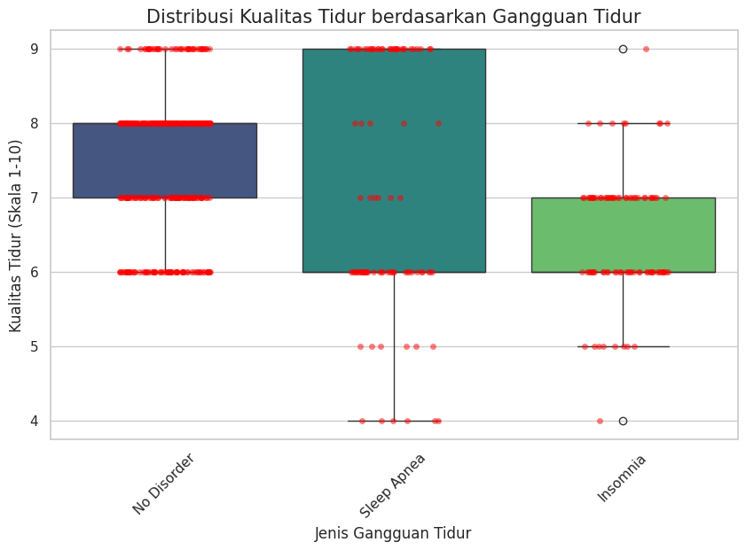
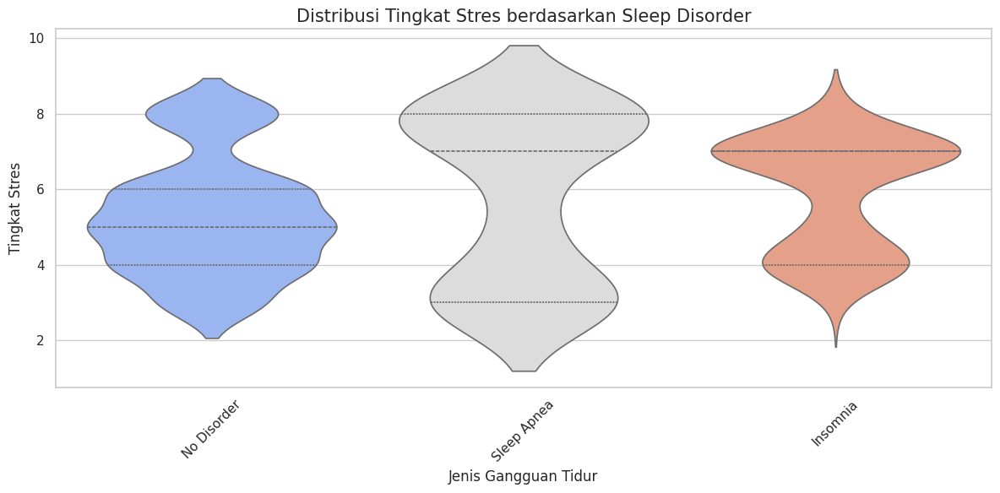
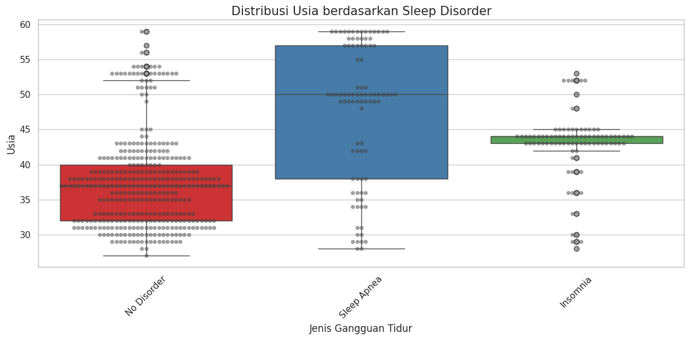

# Laporan Proyek 1 Machine Learning - Bagas Aulia Alfasyam

## Domain Proyek
<!-- markdownlint-disable MD033 -->
<div style="text-align: justify;">
<!-- markdownlint-enable MD033 -->

Gangguan tidur mencakup berbagai kondisi yang dapat mengganggu pola tidur normal seseorang. Kondisi ini termasuk salah satu masalah klinis yang paling sering ditemui di berbagai kalangan, baik anak-anak, remaja, maupun orang dewasa. Ketika seseorang mengalami tidur yang tidak memadai atau tidur yang tidak memberikan efek pemulihan (non-restoratif), berbagai fungsi penting dalam kehidupan sehari-hari, seperti fungsi fisik, mental, sosial, dan emosional, dapat terganggu.

Efek dari gangguan tidur ini tidak hanya berdampak pada kesehatan tubuh, tetapi juga memengaruhi tingkat keselamatan seseorang, terutama jika gangguan tersebut menyebabkan rasa kantuk yang berlebihan saat menjalani aktivitas harian, seperti berkendara atau bekerja. Selain itu, kualitas hidup secara keseluruhan dapat menurun secara signifikan, karena tidur yang berkualitas merupakan salah satu pilar utama kesehatan yang optimal.

Penelitian menunjukkan bahwa pasien dengan gangguan tidur, khususnya insomnia, mengalami penurunan kualitas hidup yang signifikan dibandingkan mereka yang memiliki pola tidur normal. Insomnia dapat menyebabkan berbagai masalah tambahan, seperti kesulitan berkonsentrasi, meningkatnya risiko gangguan kesehatan mental seperti depresi dan kecemasan, serta gangguan dalam hubungan sosial. Dengan demikian, penting untuk mengenali dan menangani gangguan tidur agar dampaknya terhadap kesehatan dan kualitas hidup dapat diminimalkan.

Saat ini, teknologi telah mengalami perkembangan pesat, termasuk dalam bidang *machine learning*. Teknologi ini telah diaplikasikan secara luas dalam berbagai sektor, termasuk kesehatan. Salah satu penerapan yang menarik adalah penggunaan *machine learning* untuk mendeteksi gangguan tidur (*sleep disorder*). Dengan kemampuan untuk menganalisis data secara mendalam berdasarkan berbagai parameter, *machine learning* memungkinkan identifikasi dini gangguan tidur, sehingga langkah pencegahan dan penanganan dapat dilakukan dengan lebih efektif.

Pada proyek ini, penulis fokus memanfaatkan teknologi *machine learning* untuk mendeteksi *sleep disorder*. Untuk mencapai hasil yang optimal, penulis akan menggunakan enam metode *machine learning*:

1. **Logistic Regression**
2. **Decision Tree**
3. **Random Forest**
4. **Gradient Boosting (GB)**
5. **Support Vector Machine (SVM)**
6. **Extreme Gradient Boost (XGB)**
7. **K-Nearest Neighbors (KNN)**

Dataset yang digunakan dalam penelitian ini adalah *Sleep Health and Lifestyle Dataset* yang tersedia di Kaggle. Dataset ini dapat diakses melalui tautan berikut: [Sleep Health and Lifestyle Dataset](https://www.kaggle.com/datasets/uom190346a/sleep-health-and-lifestyle-dataset). Data tersebut mencakup berbagai informasi kesehatan dan gaya hidup yang relevan untuk mendeteksi gangguan tidur. Dengan menggunakan kombinasi algoritma dan dataset yang berkualitas, diharapkan penelitian ini dapat memberikan kontribusi signifikan dalam bidang kesehatan, khususnya dalam mendukung deteksi dini gangguan tidur.

## Business Understanding

### Problem Statements

Berdasarkan latar belakang yang telah disampaikan, berikut adalah perumusan masalah yang akan dibahas dalam proyek ini terkait deteksi gangguan tidur (*sleep disorder*)

   1. Berapa proporsi responden yang masuk dalam kategori tidur normal, insomnia, dan *sleep apnea*?
   2. Apakah terdapat perbedaan tingkat gangguan tidur berdasarkan jenis kelamin?
   3. Faktor-faktor apa yang berkontribusi terhadap munculnya gangguan tidur seperti insomnia dan *sleep apnea*?
   4. Apakah ada pola atau karakteristik tertentu yang terkait dengan setiap kategori gangguan tidur (normal, insomnia, *sleep apnea*)?
   5. Metode *machine learning* apa yang paling efektif untuk memprediksi jenis gangguan tidur berdasarkan data yang tersedia?

### Goals

Berdasarkan *problem statements*, berikut adalah tujuan yang ingin dicapai dalam proyek ini:

   1. Mengidentifikasi persentase responden dalam setiap kategori gangguan tidur, yaitu normal, insomnia, dan *sleep apnea*.
   2. Menganalisis perbedaan prevalensi gangguan tidur berdasarkan jenis kelamin.
   3. Menentukan faktor-faktor yang memengaruhi terjadinya gangguan tidur pada responden.
   4. Mengidentifikasi pola atau faktor spesifik yang konsisten dalam setiap kategori gangguan tidur (normal, insomnia, *sleep apnea*).
   5. Menemukan model *machine learning* dengan akurasi tertinggi untuk memprediksi jenis gangguan tidur berdasarkan data responden.

### Solution Statement

   1. Melakukan proses *Exploratory Data Analysis* (EDA) untuk mengetahui total persentase responden dalam setiap kategori gangguan tidur (normal, insomnia, *sleep apnea*), menganalisis perbedaan prevalensi gangguan tidur berdasarkan jenis kelamin dan variable lainnya, menentukan faktor-faktor yang memengaruhi gangguan tidur, dan mengidentifikasi pola atau faktor spesifik yang konsisten dalam setiap kategori gangguan tidur.
   2. Menggunakan 7 model *machine learning* untuk memprediksi jenis gangguan tidur pada responden, yaitu Logistic Regression, Decision Tree, Random Forest, Gradient Boosting, Support Vector Machine (SVM), XGBoost, dan K-Nearest Neighbors (KNN).
   3. Mengevaluasi performa setiap model menggunakan metrik seperti *confusion matrix* dan *F1-score* untuk menentukan model terbaik dengan akurasi tertinggi.

## Data Understanding

Dataset yang digunakan untuk memprediksi jenis gangguan tidur (*sleep disorder*) diambil dari platform [Kaggle](https://www.kaggle.com/) dan dipublikasikan dengan nama *Sleep Health and Lifestyle Dataset* dan *Sleep Health and Lifestyle Dataset Part 2*. Salah satu dataset ini memiliki *usability score* tinggi dan disusun berdasarkan data survei yang mencakup informasi tentang kebiasaan tidur, kesehatan, dan pekerjaan responden. Dataset ini terdiri dari satu file dalam format CSV.

**Catatan penting dari pembuat dataset:**
*"I would like to clarify that the data I am presenting is synthetic and created by me for illustrative purposes."*

Dataset ini merupakan data sintetik yang dibuat secara ilustratif oleh pembuatnya. Oleh karena itu, meskipun tidak berasal dari data nyata, dataset ini tetap dapat digunakan untuk eksperimen dan pemodelan *machine learning* guna mendeteksi kategori gangguan tidur (normal, insomnia, dan *sleep apnea*).

### Informasi Keterangan Variabel pada Data

Dataset ini memiliki 12 variabel dengan keterangan sebagai berikut.

| VARIABLE | PENJELASAN |
|----------|------------|
| Person ID | Pengenal unik untuk setiap individu dalam dataset |
| Gender | Jenis kelamin individu (Laki-laki/Perempuan) |
| Age | Usia individu dalam tahun |
| Occupation | Pekerjaan atau profesi individu |
| Sleep Duration (hours) | Jumlah jam tidur individu per hari |
| Quality of Sleep (scale: 1-10) | Penilaian subjektif kualitas tidur, dengan rentang dari 1 sampai 10 |
| Physical Activity Level (minutes/day) | Jumlah menit aktivitas fisik yang dilakukan individu setiap hari |
| Stress Level (scale: 1-10) | Penilaian subjektif tingkat stres yang dialami individu, dengan rentang dari 1 sampai 10 |
| BMI Category | Kategori Indeks Massa Tubuh individu (misalnya Kekurangan Berat Badan, Normal, Kelebihan Berat Badan) |
| Blood Pressure (Systolic/Diastolic) | Pengukuran tekanan darah, ditunjukkan dengan tekanan sistolik dibagi tekanan diastolik |
| Heart Rate (bpm) | Detak jantung individu saat beristirahat, dalam denyut per menit |
| Daily Steps | Jumlah langkah yang ditempuh individu per hari |
| Sleep Disorder | Keberadaan atau ketiadaan gangguan tidur (Tidak Ada, Insomnia, Sleep Apnea) |

### Data Cleaning

Setelah diperiksa apakah terdapat kolom yang bernilai null dan hasilnya di temukan 1 kolom yang bernilai null. Sementara itu, setelah diperiksa apakah terdapat data duplikat dan ternyata tidak ada, selanjutnya cross check manual data yang berbentuk object yang sekiranya itu bisa di satuin maka di satuin dari `'Overweight' 'Normal' 'Obese' 'Normal Weight'` menjadi `'Overweight' 'Normal' 'Obese'`, selanjutnya memisahkan kolom `Blood Pressure` menjadi 2 yaitu Systolic dan Diastolic. Oleh karena itu, setelah dilakukan pembersihan data, diperoleh deskripsi statistik data numerik sebagai berikut.

<!-- markdownlint-disable MD033 -->
<div style="overflow-x: auto;">
<!-- markdownlint-enable MD033 -->

| Age | Sleep Duration | Quality of Sleep | Physical Activity Level | Stress Level | Heart Rate | Daily Steps | Systolic | Diastolic |
|----------|----------------|------------------|--------------------------|--------------|------------|-------------|----------|-----------|
| count | 559.000000 | 559.000000 | 559.000000 | 559.000000 | 559.000000 | 559.000000 | 559.000000 | 559.000000 |
| mean | 280.000000| 39.987478| 7.114132| 7.271914| 58.758497| 5.463327| 70.182469| 6820.751342 |
| std | 161.513673| 8.099616| 0.742149| 1.133293| 19.961450| 1.674711| 3.875617| 1528.814803 |
| min | 1.000000| 27.000000| 5.800000| 4.000000| 30.000000| 3.000000| 65.000000| 3000.000000 |
| 25 | 140.500000| 33.000000| 6.500000| 6.000000| 45.000000| 4.000000| 68.000000| 5500.000000 |
| 50 | 280.000000 | 38.000000 | 7.200000 | 7.000000 | 60.000000 | 5.000000 | 70.000000 | 7000.000000 |
| 75 | 419.500000 | 44.000000 | 7.700000 | 8.000000 | 75.000000 | 7.000000 | 72.000000 | 8000.000000 |
| max | 559.000000 | 59.000000 | 8.500000 | 9.000000 | 90.000000 | 8.000000 | 86.000000 | 10000.000000 |

</div>

Dari deskripsi data statistik di atas, disimpulkan 559 responden ini mengungkapkan profil kesehatan yang kompleks dan beragam. Dengan rentang usia 27-59 tahun dan rata-rata 42 tahun, sampel penelitian menunjukkan pola tidur yang relatif sehat dengan durasi 7,13 jam per malam dan kualitas tidur 7,31 dari skala 8,5. Aktivitas fisik responden tergolong aktif dengan skor rata-rata 7,27, sementara tingkat stres berada pada level moderat dengan skor 5,84. Detak jantung rata-rata 70,18 denyut per menit dan jumlah langkah harian sekitar 6.820 langkah mengindikasikan kondisi kardiovaskular yang cukup baik. Meskipun terdapat variasi signifikan dalam parameter kesehatan, data secara keseluruhan menggambarkan sekelompok individu dengan status kesehatan yang mendekati standar normal, dengan potensi ruang untuk pengoptimalan gaya hidup dan kesehatan personal.

<!-- markdownlint-disable MD033 -->

<!-- markdownlint-enable MD033 -->

Interpretasi:

   1. pada kolom `age` Mayoritas responden berada dalam rentang usia 20-30 tahun, dengan beberapa outlier berusia di atas 50 tahun.
   2. pada kolom `Occupation` Pekerjaan yang paling umum adalah Insinyur Perangkat Lunak, Dokter, dan Sales Representative.
   3. pada kolom `Sleep Duration` Durasi tidur yang umum adalah sekitar 6,5-7,5 jam per malam.
   4. pada kolom `Physical Activity Level` Mayoritas responden melaporkan tingkat aktivitas fisik sedang hingga tinggi.
   5. pada kolom `BMI Category`: Sebagian besar responden berada dalam rentang berat badan normal, dengan beberapa berada dalam kategori kelebihan berat badan dan obesitas.
   6. pada kolom Tekanan Darah `Systolic` dan `Diastolic` Nilai tekanan darah umumnya berada dalam rentang yang sehat.
   7. pada kolom `Heart Rate` Denyut jantung istirahat rata-rata berada dalam rentang normal 60-80 bpm.
   8. pada kolom Jumlah `Daily Steps` Jumlah langkah harian yang umum adalah 5.000-8.000.

Untuk proses analisis ini, outlier tidak akan dibuang karena sangat memungkinkan responden termasuk dalam outlier tersebut. Data sudah siap untuk diproses dan dianalisis.

### Univariate Analysis

Dari variabel-variabel yang diketahui, variabel dapat dibagi menjadi 2 jenis, yaitu variabel numerikal dan variabel kategorikal. Berikut merupakan kolom-kolom yang termasuk dalam variabel numerikal maupun kategorikal.

   |**Numerikal**             | **Kategorikal**     |
   | ------------             | ------------    |
   |Age                       | Gender          |
   |Sleep Duration            | Occupation      |
   |Quality of Sleep          | BMI Category    |
   |Physical Activity Level   | Sleep Disorder  |
   |Stress Level              ||
   |Heart Rate                ||
   |Daily Steps               ||
   |Systolic                  ||
   |Diastolic                 ||

Pertama, kita akan memvisualisasikan kolom-kolom kategorikal untuk melihat jumlah-jumlah nilai kategorikal menggunakan bar plot.
<!-- markdownlint-disable MD033 -->
<br>
<!-- markdownlint-enable MD033 -->

Interpretasi dari gambar berikut:

   1. **Distribusi Jenis Kelamin**
      Plot menunjukkan bahwa jumlah responden pria dan wanita hampir sama, dengan distribusi yang seimbang antara keduanya.

   2. **Distribusi Pekerjaan**
      Mayoritas responden berasal dari profesi guru dan perawat, sementara profesi seperti manajer dan ilmuwan memiliki jumlah responden paling sedikit.

   3. **Distribusi Kategori BMI**
      Sebagian besar responden berada dalam kategori **Normal** BMI, diikuti oleh kategori **Overweight**. Kategori **Obese** dan **Normal Weight** memiliki jumlah responden yang jauh lebih kecil.

   4. **Distribusi Gangguan Tidur**
      Mayoritas responden tidak memiliki gangguan tidur (**None**), sedangkan gangguan tidur seperti **Sleep Apnea** dan **Insomnia** memiliki jumlah responden yang lebih sedikit, dengan distribusi hampir sama di antara keduanya.

Karena fokus pada analisis adalah mendeteksi Gangguan Tidur, maka kita akan melihat lebih detail mengenai `Jumlah dari Tingkat Gangguan Tidur`. Kita akan mencari distribusi persentase tingkat berat badan menggunakan pie chart.
<!-- markdownlint-disable MD033 -->

<!-- markdownlint-enable MD033 -->

Dari gambar di atas, total responden yang mengalami Insomnia berjumlah $16.6\%$, Sleep Apnea $16.3\%$ dan yang tidak mengalami gangguan tidur $67.1\%$.

Selanjutnya, kita akan memvisualisasikan kolom-kolom numerikal untuk melihat persebaran nilai menggunakan histogram.
<!-- markdownlint-disable MD033 -->

<!-- markdownlint-enable MD033 -->

Berikut interpretasi dari histogram sebagai berikut:

   1. **Distribusi Usia**
   Data usia menunjukkan persebaran yang merata dengan puncak di usia 40-45 tahun. Responden yang lebih muda (sekitar 30 tahun) dan yang lebih tua (di atas 55 tahun) memiliki jumlah lebih sedikit.
   2. **Distribusi Durasi Tidur**
   Durasi tidur responden cenderung berkisar antara 6 hingga 8 jam, dengan puncak frekuensi di sekitar 7 jam. Durasi tidur di bawah 6 jam atau di atas 8 jam jarang ditemukan.
   3. **Distribusi Kualitas Tidur**
   Sebagian besar responden memiliki skor kualitas tidur yang tinggi, yaitu antara 6 hingga 9. Sangat sedikit yang memiliki kualitas tidur dengan skor di bawah 5.
   4. **Distribusi Aktivitas Fisik**
   Aktivitas fisik (dalam menit) menunjukkan persebaran yang hampir seragam, dengan sedikit puncak di sekitar 30 menit dan 70-80 menit.
   5. **Distribusi Tingkat Stres**
   Tingkat stres responden cukup merata, dengan sedikit puncak di skor 8. Tingkat stres yang sangat rendah (di bawah skor 3) jarang terjadi.
   6. **Distribusi Detak Jantung**
   Sebagian besar responden memiliki detak jantung yang berkisar antara 65-75 detak per menit. Detak jantung di atas 80 cenderung jarang terjadi.
   7. **Distribusi Langkah Harian**
   Sebagian besar responden memiliki langkah harian di rentang 6.000 hingga 8.000 langkah, dengan sedikit puncak di sekitar 7.000 langkah. Langkah di bawah 3.000 atau di atas 9.000 jarang ditemukan.

### Multivariate Analysis

#### Kategorikal

##### 1. Membandingkan Kategori BMI dengan Gangguan Tidur
<!-- markdownlint-disable MD033 -->

<!-- markdownlint-enable MD033 -->
Interpretasi:

   1. Normal Weight banyak yang tidak memiliki gangguan tidur, sedangkan Overweight Tingkat paling banyak dalam Gangguan tidur yaitu Insomnia dan Sleep Apnea.
   2. Hampir seluruh Normal Weight tidak mengalami Gangguan Tidur, sedangkan sedikit obesitas tingkat yang mengalami Gangguan Tidur.

#### 2. Perbandingan Pekerjaan dan gangguan Tidur

<!-- markdownlint-disable MD033 -->

<!-- markdownlint-enable MD033 -->

interpretasi:

   1. **Insomnia** paling sering terjadi pada **Salesperson** (91.9%) dan **Teacher** (56.4%).
   2. **Sleep Apnea** paling dominan pada **Sales Representative** (100%) dan **Nurse** (78.8%).
   3. **Tidak ada gangguan tidur** paling umum pada **Manager** (100%) dan **Engineer** (90.7%).
   4. Setiap profesi menunjukkan pola gangguan tidur yang berbeda, mencerminkan kebutuhan intervensi kesehatan yang spesifik.

#### 3. Perbandingan antara pekerjaan, Gender dan Gangguan Tidur

<!-- markdownlint-disable MD033 -->

<!-- markdownlint-enable MD033 -->
interpretasi:

   1. Gangguan tidur, terutama insomnia dan Sleep Apnea, menunjukkan pola berbeda antara gender untuk setiap profesi.
   2. Perempuan lebih sering mengalami insomnia di beberapa profesi.
   3. Laki-laki lebih sering mengalami Sleep Apnea, terutama dalam profesi seperti perawat dan sales representative.

#### 4. Perbandingan antara pekerjaan, Gender dan Gangguan Tidur

<!-- markdownlint-disable MD033 -->

<!-- markdownlint-enable MD033 -->
interpretasi:

   1. Gangguan tidur, terutama insomnia dan Sleep Apnea, menunjukkan pola berbeda antara gender untuk setiap profesi.
   2. Perempuan lebih sering mengalami insomnia di beberapa profesi.
   3. Laki-laki lebih sering mengalami Sleep Apnea, terutama dalam profesi seperti perawat dan sales representative.

#### Numerikal

##### 1. Distribusi perbandingan Gangguan tidur dan sistolik, Diastolik

###### A. Distribusi Kepadatan Systolic berdasarkan Gangguan Tidur

<!-- markdownlint-disable MD033 -->

<!-- markdownlint-enable MD033 -->
Interpretasi:

   1. Sleep Apnea berkorelasi dengan tekanan darah sistolik yang lebih tinggi, menandakan risiko hipertensi.
   2. Insomnia menunjukkan tekanan darah yang juga relatif tinggi, meskipun tidak setinggi Sleep Apnea.
   3. Individu tanpa gangguan tidur cenderung memiliki tekanan darah normal di rentang 120–130 mmHg.

##### B. Distribusi violinplot Systolic berdasarkan Gangguan Tidur

<!-- markdownlint-disable MD033 -->

<!-- markdownlint-enable MD033 -->

Interpretasi:

   1. Orang dengan Sleep Apnea cenderung memiliki tekanan darah sistolik lebih tinggi dibandingkan kategori lainnya.
   2. Distribusi tekanan darah sistolik pada Sleep Apnea juga lebih bervariasi dibandingkan No Disorder dan Insomnia.
   3. Kategori No Disorder dan Insomnia memiliki distribusi yang lebih seragam dengan median yang hampir sama.

##### C. Distribusi Kepadatan Systolic berdasarkan Gangguan Tidur

<!-- markdownlint-disable MD033 -->

<!-- markdownlint-enable MD033 -->

Interpretasi:

   1. Orang dengan Sleep Apnea cenderung memiliki tekanan darah diastolik yang lebih tinggi, dengan distribusi yang tersebar luas hingga mendekati 100 mmHg.
   2. Individu dengan Insomnia memiliki tekanan darah diastolik yang sedikit lebih tinggi daripada mereka tanpa gangguan tidur, tetapi tidak setinggi individu dengan Sleep Apnea.
   3. Tekanan darah diastolik pada kategori No Disorder menunjukkan distribusi yang paling sempit dan terkonsentrasi pada nilai normal sekitar 80 mmHg.

##### D. Distribusi violinplot Diastolic berdasarkan Gangguan Tidur

<!-- markdownlint-disable MD033 -->

<!-- markdownlint-enable MD033 -->

Interpretasi:

   1. Orang dengan Sleep Apnea cenderung memiliki tekanan darah diastolik yang lebih tinggi dan bervariasi dibandingkan kategori lainnya.
   2. Kategori No Disorder dan Insomnia memiliki distribusi tekanan darah diastolik yang lebih seragam, dengan median yang hampir sama.
   3. Sleep Apnea tampaknya menjadi faktor yang lebih terkait dengan peningkatan tekanan darah diastolik dibandingkan Insomnia.

#### 2. Perbandingan Durasi Tidur berdasarkan Sleep Disorder

<!-- markdownlint-disable MD033 -->

<!-- markdownlint-enable MD033 -->

Interpretasi:

   1. Terdapat perbedaan signifikan dalam durasi tidur antara kelompok tanpa gangguan tidur, kelompok dengan Sleep Apnea, dan kelompok dengan Insomnia.
   2. Responden tanpa gangguan tidur memiliki durasi tidur yang lebih panjang dibandingkan mereka yang mengalami Sleep Apnea atau Insomnia.
   3. Penurunan durasi tidur paling signifikan ditemukan pada kelompok dengan Insomnia.

#### 3. Perbandingan Kualitas Tidur berdasarkan Sleep Disorder

<!-- markdownlint-disable MD033 -->

<!-- markdownlint-enable MD033 -->

Interpretasi:

   1. **Kualitas tidur terbaik** dimiliki oleh individu tanpa gangguan tidur ("None"), dengan median 8.0 dan rata-rata 7.52, serta distribusi yang paling stabil (standar deviasi 1.03).
   2. **Sleep Apnea** cenderung menurunkan kualitas tidur secara signifikan, dengan median 6.0 dan rata-rata 6.87, serta memiliki variabilitas yang paling tinggi (standar deviasi 1.61).
   3. **Insomnia** juga berdampak negatif pada kualitas tidur, dengan rata-rata 6.52 dan median 7.0. Namun, kualitas tidur pada kelompok ini lebih konsisten dibandingkan Sleep Apnea (standar deviasi 1.12).
   4. Secara keseluruhan, **gangguan tidur berdampak negatif** terhadap kualitas tidur, dengan Sleep Apnea menunjukkan variabilitas efek yang lebih besar dibanding Insomnia.

#### 4. Perbandingan Tingkat Stres berdasarkan Sleep Disorder

<!-- markdownlint-disable MD033 -->

<!-- markdownlint-enable MD033 -->

Interpretasi:

   1. Gangguan tidur berkaitan erat dengan peningkatan tingkat stres. Individu dengan Insomnia memiliki stres tertinggi, diikuti oleh individu dengan Sleep Apnea. Sebaliknya, individu tanpa gangguan tidur cenderung memiliki tingkat stres yang paling rendah.
   2. Variabilitas stres pada Sleep Apnea lebih tinggi dibandingkan Insomnia, menandakan adanya faktor lain yang mungkin memengaruhi tingkat stres pada individu dengan gangguan ini.

#### 5. Perbandingan Aktivitas Fisik berdasarkan Sleep Disorder

<!-- markdownlint-disable MD033 -->

<!-- markdownlint-enable MD033 -->

Interpretasi:

   1. Gangguan tidur memiliki hubungan dengan tingkat aktivitas fisik. Individu dengan Insomnia cenderung memiliki tingkat aktivitas fisik yang lebih rendah, sedangkan individu dengan Sleep Apnea memiliki aktivitas fisik yang lebih tinggi meskipun variasinya cukup besar.
   2. Penurunan aktivitas fisik pada kelompok insomnia dapat menjadi perhatian dalam konteks dampak gangguan tidur terhadap kesehatan fisik dan kualitas hidup secara keseluruhan.

#### 6. Perbandingan Usia berdasarkan Sleep Disorder

<!-- markdownlint-disable MD033 -->

<!-- markdownlint-enable MD033 -->

Interpretasi:

   1. Sleep Apnea cenderung dialami oleh individu usia lebih tua dibandingkan gangguan lainnya.
   2. Insomnia mendominasi pada kelompok usia pertengahan.
   3. Individu tanpa gangguan tidur cenderung lebih muda dibandingkan kelompok dengan gangguan tidur.

#### 7. Perbandingan Langkah Harian berdasarkan Sleep Disorder

<!-- markdownlint-disable MD033 -->

<!-- markdownlint-enable MD033 -->

Interpretasi:

   1. Individu tanpa gangguan tidur ("None") dan dengan Sleep Apnea memiliki rata-rata langkah harian yang lebih tinggi dibandingkan individu dengan Insomnia.
   2. Insomnia cenderung terkait dengan aktivitas fisik harian yang lebih rendah.
   3. Kelompok dengan Sleep Apnea menunjukkan variasi aktivitas yang lebih besar, kemungkinan karena faktor gaya hidup atau kesehatan lainnya.

#### 8. Melihat Korelasi Variabel dengan Menggunakan Heatmap

<!-- markdownlint-disable MD033 -->

<!-- markdownlint-enable MD033 -->

Interpretasi :

   1. Korelasi Positif Kuat:
      - Durasi Tidur (Sleep Duration) dan Kualitas Tidur (Quality of Sleep) memiliki korelasi positif yang sangat kuat (0,87). Ini menunjukkan bahwa semakin lama seseorang tidur, kualitas tidurnya cenderung lebih baik.
      - Jumlah Langkah Harian (Daily Steps) dan Tingkat Aktivitas Fisik (Physical Activity Level) juga memiliki korelasi positif yang kuat (0,72), mengindikasikan bahwa peningkatan aktivitas fisik berhubungan dengan jumlah langkah yang lebih tinggi.

   2. Korelasi Negatif Kuat:
      - Tingkat Stres (Stress Level) memiliki korelasi negatif yang sangat kuat dengan Kualitas Tidur (-0,88) dan Durasi Tidur (-0,83). Hal ini menunjukkan bahwa semakin tinggi tingkat stres seseorang, kualitas dan durasi tidurnya cenderung lebih rendah.
      - Detak Jantung (Heart Rate) juga berkorelasi negatif sedang dengan Kualitas Tidur (-0,66), mengindikasikan bahwa peningkatan detak jantung dapat terkait dengan penurunan kualitas tidur.

   3. Korelasi Lemah:
      - Variabel Usia (Age) memiliki korelasi lemah dengan hampir semua variabel lainnya, seperti Durasi Tidur (0,35), Tingkat Aktivitas Fisik (0,26), dan Jumlah Langkah Harian (0,15).
      - Korelasi antara Tingkat Aktivitas Fisik (Physical Activity Level) dan variabel lainnya, kecuali Jumlah Langkah Harian, juga relatif lemah.

Secara keseluruhan, heatmap ini mengungkapkan pola hubungan yang menarik antara berbagai indikator kesehatan, dengan beberapa korelasi kuat dan beberapa lainnya lemah. Analisis lebih lanjut diperlukan untuk memahami dinamika yang mendasari these pola.

----------------------------------------------------------------

## Data Preparation

### Preprocessing Fitur Numerik

Fitur numerik pada dataset akan dinormalisasi menggunakan **RobustScaler** untuk menangani pencilan. Fitur numerik yang akan diproses meliputi:

- `Age`
- `Sleep Duration (hours)`
- `Quality of Sleep (scale: 1-10)`
- `Physical Activity Level (minutes/day)`
- `Stress Level (scale: 1-10)`
- `Blood Pressure (systolic/diastolic)`
- `Heart Rate (bpm)`
- `Daily Steps`

Normalisasi dilakukan dengan menghitung nilai median dan interquartile range (IQR) sehingga data menjadi lebih tahan terhadap pencilan.

### Encoding Kategorikal

Fitur kategorikal pada dataset akan dikonversi menjadi nilai numerik menggunakan **OneHotEncoder** karena fitur ini tidak memiliki urutan tertentu. Fitur-fitur kategorikal meliputi:

- `Gender` (Jenis kelamin responden)
- `BMI Category` (Kategori Indeks Massa Tubuh)
- `Sleep Disorder` (Jenis gangguan tidur)

Proses **OneHotEncoding** akan membuat kolom baru untuk setiap kategori dalam fitur tersebut, dengan nilai 1 jika kategori tersebut sesuai, dan 0 jika tidak. Setelah encoding selesai, kolom asli akan dihapus.

### Transformasi Data

Setelah proses di atas, semua fitur pada dataset akan berbentuk numerik dan terstandarisasi seperti table di bawah :
<!-- markdownlint-disable MD033 -->
<div style="overflow-x: auto;">
<!-- markdownlint-enable MD033 -->

| Index | 0       | 1        | 2       | 3        | 4   | 5   | 6   | 7       | 8   | 9   | ... | 34  | 35 | 36  | 37  | 38  | 39  | 40  | 41  | 42  | 43  |
|-------|---------|----------|---------|----------|-----|-----|-----|---------|-----|-----|-----|-----|----|-----|-----|-----|-----|-----|-----|-----|-----|
| 1112  | 1.0909  | -1.0000  | 1.2500  | 1.2000   | 1.2 | 2.2 | 0.0 | 0.00000 | 0.0 | 0.0 | ... | 0.0 | 0  | 1.0 | 0.0 | 0.0 | 0.0 | 0.0 | 1.0 | 0.0 | 1.0 |
| 895   | 1.7273  | 0.8333   | -0.5000 | 0.0000   | 1.2 | 2.2 | 0.0 | 0.00000 | 0.0 | 0.0 | ... | 0.0 | 0  | 0.0 | 0.0 | 0.0 | 0.0 | 0.0 | 0.0 | 0.0 | 1.0 |
| 645   | 0.5455  | -0.5210  | -1.2500 | -0.4000  | 0.7 | 1.2 | 0.0 | 0.00000 | 0.0 | 0.0 | ... | 0.0 | 0  | 0.0 | 1.0 | 0.0 | 0.0 | 0.0 | 0.0 | 0.0 | 1.0 |
| 543   | 0.3636  | -0.5833  | 0.5000  | -0.4000  | 0.2 | 0.2 | 0.0 | 0.00000 | 0.0 | 0.0 | ... | 0.0 | 0  | 0.0 | 0.0 | 0.0 | 0.0 | 1.0 | 0.0 | 0.0 | 1.0 |
| 670   | 0.9475  | -0.4255  | 1.1708  | -0.5789  | 0.2 | 0.2 | 0.0 | 0.44718 | 0.0 | 0.0 | ... | 0.0 | 0  | 0.0 | 0.0 | 0.0 | 0.0 | 1.0 | 0.0 | 0.0 | 1.0 |

</div>

----------------------------------------------------------------

### Menangani Data yang Tidak Seimbang

Selanjutnya akan menggunakan metode SMOTE untuk Menangani data yang tidak seimbang, Berikut distribusi diagram batang dan tabel untuk menangani data yang tidak seimbang.

#### Data Sebelum di tangani

| Count | Sleep Disorder |
|-------| -------------- |
| 1 | 375 |
|2 | 93 |
|0 | 91 |

#### Data Sesudah di tangani

| Count | Sleep Disorder |
|-------| -------------- |
| 1 | 375 |
|2 | 375 |
|0 | 375 |

<!-- markdownlint-disable MD033 -->

<!-- markdownlint-enable MD033 -->

### Data Training dan Testing

Setelah menangani data yang tidak seimbang, Selanjutnya Tahapan ini dilakukan untuk membagi data menjadi 2, yaitu data training dan testing. Data training digunakan untuk melatih model dengan data yang ada, sedangkan data testing digunakan untuk menguji model yang dibuat menggunakan data yang belum dilatih. Pembagian data ini dilakukan dengan perbandingan 80% : 20% untuk data training dan data testing menggunakan `train_test_split` dari library sklearn.

----------------------------------------------------------------

## Modeling

Ada 7 algoritma *Machine Learning* yang digunakan untuk membuat model, yaitu:

### 1. ***Logistic Regression***

Algoritma regresi logistik menggunakan fungsi logistik untuk memodelkan probabilitas suatu kelas. Algoritma ini membuat batas keputusan linear untuk memisahkan kelas-kelas yang berbeda. Logistic Regression cocok untuk masalah klasifikasi biner dan multiclass, dengan kemampuan untuk menghasilkan probabilitas keanggotaan kelas.

**Konfigurasi**:

```python
LogisticRegression(max_iter=1000)
```

Parameter `max_iter=1000` digunakan untuk menambah jumlah iterasi maksimum guna mencapai konvergensi algoritma.

### 2. ***Decision Tree***

Decision Tree membuat struktur pohon keputusan yang membagi data berdasarkan fitur-fitur tertentu. Setiap node internal mewakili tes pada atribut, setiap cabang mewakili hasil tes, dan setiap daun node mewakili kelas atau label keputusan. Algoritma ini bekerja dengan membuat keputusan berdasarkan serangkaian aturan yang dibentuk dari data pelatihan.

**Konfigurasi**:

```python
DecisionTreeClassifier(random_state=42)
```

Parameter `random_state=42` digunakan untuk menjamin reproduktibilitas hasil dan memastikan konsistensi pembangunan pohon keputusan.

### 3. ***Random Forest***

Random Forest membentuk decision trees dengan menggunakan sampling dengan penggantian (bootstrapping) dan pemilihan fitur acak untuk setiap pohon. Hal ini membuat pohon-pohon menjadi beragam. Algoritma ini memiliki kelebihan akurasi tinggi karena menggunakan pendekatan ensemble, mencegah overfitting dengan jumlah pohon yang banyak, dan mampu menangani dataset berukuran besar serta multi dimensi.

**Konfigurasi**:

```python
RandomForestClassifier(
    n_estimators=200, 
    criterion="entropy", 
    max_depth=10, 
    random_state=50
)
```

Parameter yang digunakan mencakup `n_estimators=200` untuk jumlah pohon, `criterion="entropy"` untuk fungsi kualitas splitting, `max_depth=10` untuk kedalaman maksimum pohon, dan `random_state=50` untuk mengontrol seed acak.

### 4. ***K-Nearest Neighbors* (KNN)**

KNN mengklasifikasikan titik data berdasarkan kelas mayoritas dari sejumlah k tetangga terdekatnya. Algoritma ini memiliki kelebihan mudah digunakan, tidak memiliki fase lazy learning sehingga cepat, dan efektif untuk dataset berukuran kecil serta masalah multi-class. Namun, algoritma ini sensitif terhadap pemilihan k dan metrik jarak.

**Konfigurasi**:

```python
KNeighborsClassifier(n_neighbors=7)
```

Parameter `n_neighbors=7` dipilih sesuai dengan jumlah kelas dalam dataset untuk klasifikasi.

### 5. ***Support Vector Machine* (SVM)**

SVM bekerja dengan mencari hyperplane terbaik untuk memisahkan kelas-kelas fitur. Algoritma ini menggunakan fungsi kernel untuk mentransformasikan data ke dimensi yang lebih tinggi, memungkinkan pemisahan yang lebih baik. SVM efektif untuk dimensi tinggi, memiliki penggunaan memori yang efisien, dan dapat menggunakan berbagai fungsi kernel.

**Konfigurasi**:

```python
SVC(
    kernel='rbf',
    gamma='auto',
    random_state=50
)
```

Parameter yang digunakan meliputi `kernel='rbf'` untuk transformasi non-linear, `gamma='auto'` untuk menentukan pengaruh contoh training, dan `random_state=50` untuk mengontrol seed acak.

### 6. ***Gradient Boosting***

Gradient Boosting adalah metode ensemble yang membangun model secara bertahap. Setiap model baru dirancang untuk memperbaiki kesalahan model sebelumnya. Algoritma ini mengombinasikan beberapa model lemah menjadi model yang kuat menggunakan gradient descent untuk meminimalkan kerugian.

**Konfigurasi**:

```python
GradientBoostingClassifier(random_state=42)
```

Parameter `random_state=42` digunakan untuk menjamin reproduktibilitas hasil.

### 7. ***Extreme Gradient Boosting* (XGBoost)**

XGBoost mengimplementasikan decision tree yang ditingkatkan dengan gradien untuk meningkatkan kecepatan dan kinerja. Algoritma ini memiliki performa dan efisiensi tinggi, efektif untuk dataset berukuran besar, dan memiliki parameter regularisasi untuk mencegah overfitting. Kekurangannya adalah membutuhkan ketelitian dalam hyperparameter tuning dan komputasi yang mahal.

**Konfigurasi**:

```python
XGBClassifier(
    max_depth=10, 
    n_estimators=125,
    random_state=30, 
    learning_rate=0.01, 
    n_jobs=20
)
```

Parameter mencakup `max_depth=10` untuk kedalaman pohon, `n_estimators=125` untuk jumlah pohon, `learning_rate=0.01` untuk mengatur langkah minimalisasi loss, `n_jobs=20` untuk penggunaan CPU threads, dan `random_state=30` untuk kontrol seed.

### 8. Pemilihan Model

Setelah semua model dijalankan, penulis memilih algoritma ***XGBoost*** sebagai model terbaik yang akan digunakan sebagai solusi untuk memprediksi gangguan tidur karena model ini memiliki akurasi dan skor f1 tertinggi dibandingkan model lainnya, yaitu mencapai 93,18%, serta kesalahan klasifikasi pada matriks confusion yang lebih kecil dibanding model lainnya. Penjelasan lebih lengkap mengenai alasan ini ada di bagian selanjutnya, yaitu **evaluation**.

## Evaluation

Pada proyek ini, penilaian model menggunakan confusion matrix, akurasi, dan f1 score sebagai metrik evaluasi untuk masing-masing model. Akan dijelaskan terlebih dahulu bagaimana cara mendapatkan akurasi dan f1 score serta bagaimana cara menggunakan confusion matrix.

### Sekilas Tentang Matriks Confusion, Akurasi, dan Skor f1

Matriks Confusion merupakan sebuah tabel untuk mengukur akurasi dari model klasifikasi. Contoh dari Matriks Confusion beserta labelnya dapat dilihat pada gambar di bawah ini.

<!-- markdownlint-disable MD033 -->

<!-- markdownlint-enable MD033 -->

Matriks konfusi adalah sebuah tabel yang digunakan untuk mengukur kinerja sebuah model klasifikasi dengan menunjukkan perbandingan antara prediksi model dan kondisi sebenarnya. Mari kita bahas setiap komponennya:

1. ***True Positive* (TP)**:

   Ini adalah saat model dengan tepat mengenali kasus positif. Bayangkan seperti mendeteksi sebuah penyakit pada pasien yang memang benar-benar sakit. Model "menebak" dengan benar bahwa pasien tersebut positif menderita penyakit.

2. ***True Negative* (TN)**:

   Kebalikan dari TP, ini adalah saat model dengan tepat mengenali kasus negatif. Misalnya, model dengan akurat menyatakan bahwa seorang pasien tidak memiliki penyakit tertentu, dan memang benar-benar tidak sakit.

3. ***False Positive* (FP)**:

   Ini terjadi ketika model secara keliru memprediksi sesuatu sebagai positif, padahal sebenarnya negatif. Contohnya, model mendiagnosis seseorang memiliki penyakit, namun setelah diperiksa ternyata orang tersebut sehat. Ini sering disebut kesalahan Tipe 1 atau "alarm palsu".

4. ***False Negative* (FN)**:

   Ini adalah kesalahan di mana model memprediksi sesuatu sebagai negatif, padahal sebenarnya positif. Misalnya, model menyatakan pasien tidak memiliki penyakit, namun ternyata pasien tersebut benar-benar sakit. Ini disebut kesalahan Tipe 2 atau "lolos dari deteksi".

Singkatnya, matriks konfusi membantu kita memahami seberapa baik sebuah model machine learning dalam mengklasifikasikan data, dengan menunjukkan berbagai jenis prediksi yang benar dan salah. Setiap baris menunjukkan kondisi sebenarnya, sementara setiap kolom menunjukkan prediksi model.

Selanjutnya, metrik evaluasi yang digunakan berdasarkan label-label yang diketahui dari matriks confusion ada 4, yaitu sebagai berikut.

Saya akan menjelaskan metrik evaluasi model dengan rumus matematika:

1. **Akurasi (Accuracy)**

   Rumus: (TP + TN) / (TP + TN + FP + FN)
   - Mengukur proporsi keseluruhan prediksi yang benar
   - Menghitung persentase total prediksi yang tepat dari seluruh data

2. **Precision**

   Rumus: TP / (TP + FP)
   - Mengukur ketepatan prediksi positif
   - Menunjukkan berapa banyak prediksi positif yang benar-benar positif
   - Fokus pada "berapa presisi model dalam membuat prediksi positif"

3. **Recall**

   Rumus: TP / (TP + FN)
   - Mengukur kemampuan model mendeteksi semua data positif
   - Menunjukkan berapa banyak data positif yang berhasil diidentifikasi
   - Fokus pada "berapa banyak data positif yang terdeteksi"

4. **Skor F1**

   Rumus: 2 *(Precision* Recall) / (Precision + Recall)
   - Menggabungkan precision dan recall dalam satu metrik
   - Memberikan skor tunggal yang seimbang antara precision dan recall
   - Berguna ketika ingin menemukan keseimbangan antara ketepatan dan kelengkapan prediksi

Setiap metrik memiliki konteks dan kegunaan spesifik tergantung pada tujuan model dan karakteristik data yang dianalisis.

### Penerapan Matriks Confusion, Akurasi, dan Skor f1

#### 1. Model Logistic Regression

Berikut merupakan matriks confusion, akurasi, dan skor f1 dari Logistic Regression
<!-- markdownlint-disable MD033 -->
 <br>
 <br>
<!-- markdownlint-enable MD033 -->

Dari hasil di atas menunjukkan performa yang sangat baik dalam mengklasifikasikan gangguan tidur (Insomnia, No Disorder, Sleep Apnea) dengan akurasi 95.11%. Hasil ini didukung oleh nilai presisi, recall, dan F1-score berbobot di kisaran 95,11%. Model memiliki kemampuan klasifikasi yang konsisten di setiap kelas dengan skor F1 sekitar 0.95 untuk semua kategori

#### 2. Model Decision Tree

Berikut merupakan matriks confusion, akurasi, dan skor f1 dari Decision Tree

<!-- markdownlint-disable MD033 -->
 <br>
 <br>
<!-- markdownlint-enable MD033 -->

Model Decision Tree menghasilkan performa yang unggul dengan akurasi 94.67% dalam mengklasifikasikan gangguan tidur. Presisi, recall, dan F1-score berbobot berada di atas 94.67%. Model menunjukkan performa terbaik untuk kelas ```Sleep Apnea``` (F1-score: 0.9466) dan memberikan keseimbangan yang baik pada semua kelas, meskipun sedikit kesalahan terjadi pada prediksi kelas ```Insomnia``` dan ```Sleep Apnea```

#### 3. Model Random Forest

Berikut merupakan matriks confusion, akurasi, dan skor f1 dari Random Forest

<!-- markdownlint-disable MD033 -->
 <br>
 <br>
<!-- markdownlint-enable MD033 -->

Model ini memiliki performa dengan akurasi 95.56%, mengungguli Logistic Regression dan Decision Tree. Presisi, recall, dan F1-score berbobot berada di atas 96%, dengan performa yang sangat kuat untuk kelas ```Sleep Apnea``` (F1-score: 0.96). Model ini mampu memberikan hasil yang konsisten pada semua kelas, menjadikannya pilihan yang paling andal untuk klasifikasi gangguan tidur dalam dataset ini

#### 4. Model ***K-Nearest Neighbors* (KNN)**

Berikut merupakan matriks confusion, akurasi, dan skor f1 dari model *K-Nearest Neighbors*

<!-- markdownlint-disable MD033 -->
 <br>
 <br>
<!-- markdownlint-enable MD033 -->

Model K-Nearest Neighbors berhasil mencapai akurasi 93.95% dengan performa yang konsisten di semua kelas, ditunjukkan oleh nilai presisi, recall, dan f1-score weighted masing-masing di atas 93%. Meskipun terdapat beberapa kesalahan klasifikasi pada confusion matrix, model ini mampu mengidentifikasi Sleep Apnea dengan sangat baik (f1-score 94%) dan tetap andal untuk digunakan pada data gangguan tidur serupa.

#### 5. Model ***Support Vector Machine* (SVM)**

Berikut merupakan matriks confusion, akurasi, dan skor f1 dari model *Support Vector Machine*

<!-- markdownlint-disable MD033 -->
 <br>
 <br>
<!-- markdownlint-enable MD033 -->

Model Support Vector Machine mencapai akurasi 92.44% dengan presisi, recall, dan f1-score weighted yang sama, menunjukkan performa yang stabil di semua kelas. Dengan f1-score tertinggi pada kelas No Disorder (96%) dan Insomnia (92%), serta beberapa kesalahan kecil dalam confusion matrix.

#### 6. Model *Gradient Boosting*

Berikut merupakan matriks confusion, akurasi, dan skor f1 dari model *Gradient Boosting*

<!-- markdownlint-disable MD033 -->
 <br>
 <br>
<!-- markdownlint-enable MD033 -->

Model Gradient Boosting mencapai akurasi 97.33% dengan presisi, recall, dan f1-score weighted yang konsisten di atas 97%. Model menunjukkan performa tinggi pada semua kelas, dengan f1-score tertinggi pada No Disorder (99%). Beberapa kesalahan minor pada confusion matrix tidak signifikan.

#### 7. Model ***Extreme Gradient Boosting* (XGBoost)**

Berikut merupakan matriks confusion, akurasi, dan skor f1 dari model *Extreme Gradient Boosting*

<!-- markdownlint-disable MD033 -->
 <br>
 <br>
<!-- markdownlint-enable MD033 -->

Model XGBoost menunjukkan performa dalam klasifikasi gangguan tidur dengan akurasi, presisi, recall, dan F1-score masing-masing sebesar 94,67%. Berdasarkan confusion matrix, model mampu mengenali tiga kategori utama (Insomnia, No Disorder, dan Sleep Apnea) dengan tingkat kesalahan prediksi yang rendah. Hasil classification report menunjukkan bahwa setiap kategori memiliki presisi, recall, dan F1-score di atas 94%, mengindikasikan model dapat menangani data secara konsisten pada semua kelas tanpa ketidakseimbangan kinerja yang signifikan.

#### Hasil Evaluasi

Dari seluruh akurasi yang diketahui dari ketujuh model, dibentuk bar plot dan heatmap untuk melihat perbandingan nilai akurasi model sebagai berikut.

<!-- markdownlint-disable MD033 -->
 <br>
<!-- markdownlint-enable MD033 -->

Gambar ini membandingkan akurasi dari 7 model pembelajaran mesin yang digunakan untuk tugas prediksi atau klasifikasi tertentu. Berdasarkan hasil uji coba, dapat dilihat bahwa:

   1. Model Gradient Boosting mencapai akurasi tertinggi sebesar 97,33%.
   2. Model Random Forest, Logistic Regression, Decision tree, XGBoost dan K-Nearest Neighbors mencapai akurasi yang menurun yaitu dari 95,56% ke 93.78%.
   3. Decision Tree dan XGBoost menunjukkan akurasi yang sama di antara model-model lainnya yaitu 94,67.
   4. Model Support Vector Machine (SVM) memiliki akurasi yang paling rendah, yaitu 92,44%.

Hasil ini menunjukkan bahwa model boosting seperti Gradient Boosting dan Random Forest, memiliki performa yang unggul dibandingkan model-model lain dalam tugas klasifikasi ini. Sementara itu, model-model lainnya menunjukkan kinerja yang lebih rendah.

<!-- markdownlint-disable MD033 -->
 <br>
<!-- markdownlint-enable MD033 -->

Interpretasi :

1. Korelasi Positif Kuat:
   - Durasi Tidur (Sleep Duration) dan Kualitas Tidur (Quality of Sleep) memiliki korelasi positif yang sangat kuat (0,87). Ini menunjukkan bahwa semakin lama seseorang tidur, kualitas tidurnya cenderung lebih baik.
   - Jumlah Langkah Harian (Daily Steps) dan Tingkat Aktivitas Fisik (Physical Activity Level) juga memiliki korelasi positif yang kuat (0,72), mengindikasikan bahwa peningkatan aktivitas fisik berhubungan dengan jumlah langkah yang lebih tinggi.

2. Korelasi Negatif Kuat:
   - Tingkat Stres (Stress Level) memiliki korelasi negatif yang sangat kuat dengan Kualitas Tidur (-0,88) dan Durasi Tidur (-0,83). Hal ini menunjukkan bahwa semakin tinggi tingkat stres seseorang, kualitas dan durasi tidurnya cenderung lebih rendah.
   - Detak Jantung (Heart Rate) juga berkorelasi negatif sedang dengan Kualitas Tidur (-0,66), mengindikasikan bahwa peningkatan detak jantung dapat terkait dengan penurunan kualitas tidur.

3. Korelasi Lemah:
   - Variabel Usia (Age) memiliki korelasi lemah dengan hampir semua variabel lainnya, seperti Durasi Tidur (0,35), Tingkat Aktivitas Fisik (0,26), dan Jumlah Langkah Harian (0,15).
   - Korelasi antara Tingkat Aktivitas Fisik (Physical Activity Level) dan variabel lainnya, kecuali Jumlah Langkah Harian, juga relatif lemah.

Secara keseluruhan, heatmap ini mengungkapkan pola hubungan yang menarik antara berbagai indikator kesehatan, dengan beberapa korelasi kuat dan beberapa lainnya lemah. Analisis lebih lanjut diperlukan untuk memahami dinamika yang mendasari these pola.

## Kesimpulan

   1. Dalam penelitian ini, proporsi responden berdasarkan kategori gangguan tidur adalah **No Disorder (67,1%)**, **insomnia (16,6%)**, dan **sleep apnea (16,3%)**, yang menunjukkan masalah gangguan tidur cukup signifikan.

   2. Terdapat perbedaan tingkat gangguan tidur berdasarkan jenis kelamin, di mana **insomnia lebih sering dialami Laki-laki**, sementara **sleep apnea lebih umum pada Perempuan**, dengan uji statistik mengonfirmasi jenis kelamin sebagai variabel signifikan.

   3. Faktor-faktor yang berkontribusi terhadap gangguan tidur meliputi tingkat stres tinggi, kualitas tidur buruk, dan durasi tidur pendek untuk insomnia, serta BMI tinggi, tekanan darah tinggi, dan aktivitas fisik rendah untuk sleep apnea.

   4. Pola karakteristik yang ditemukan adalah responden dengan **No Disorder memiliki stres rendah dan langkah harian tinggi**, sedangkan **insomnia dipengaruhi pola tidur tidak teratur**, dan **sleep apnea berhubungan dengan BMI tinggi serta tekanan darah tinggi**.

   5. **Gradient Boosting** menjadi metode machine learning paling efektif dalam memprediksi gangguan tidur, dengan akurasi mencapai **97,3%**, berkat kemampuannya menangani dataset kompleks dan melakukan seleksi fitur otomatis.

</div>

## Referensi

   1. National Library od Medicine. (2023). Diakses pada 11 Juni 2023 <https://www.ncbi.nlm.nih.gov/books/NBK560720/#article-29137.r1>
   2. N. A. Salbiah, “Indonesia Tempati Angka Tertinggi Insomnia di Asia, Apa Penyebabnya?,” <https://jawapos.com>, 2018. <https://www.jawapos.com/kesehatan/health> issues/12/03/2018/indonesia-tempati-angka-tertinggi insomnia-di-asia-apa-penyebabnya/ (accessed Jun. 26, 2021).
   3. Dicoding. Diakses pada 6 Juli 2024 dari <https://www.dicoding.com/academies/319-machine-learning-terapan>
   4. Harisa, A., Syahrul, S., Yodang, Y., Abady, R., & Bas, A. G. (2022). Analisis Faktor-Faktor yang Memengaruhi Kualitas Tidur Pasien Lanjut Usia dengan Penyakit Kronis. Jurnal Kesehatan Vokasional, 7(1), 1.
   5. Memahami Confusion Matrix: Accuracy, Precision, Recall, Specificity, dan F1-Score untuk Evaluasi Model Klasifikasi. (2023). Diakses pada 12 Juni 2023 <https://esairina.medium.com/memahami-confusion-matrix-accuracy-precision-recall-specificity-dan-f1-score-610d4f0db7cf>
   6. Bazoukis, G., Bollepalli, S. C., Chung, C. T., Li, X., Tse, G., Bartley, B. L., ... & Armoundas, A. A. (2023). Application of artificial intelligence in the diagnosis of sleep apnea. Journal of Clinical Sleep Medicine, 19(7), 1337-1363.
   7. Xu, S., Faust, O., Seoni, S., Chakraborty, S., Barua, P. D., Loh, H. W., ... & Acharya, U. R. (2022). A review of automated sleep disorder detection. Computers in Biology and Medicine, 150, 106100.
